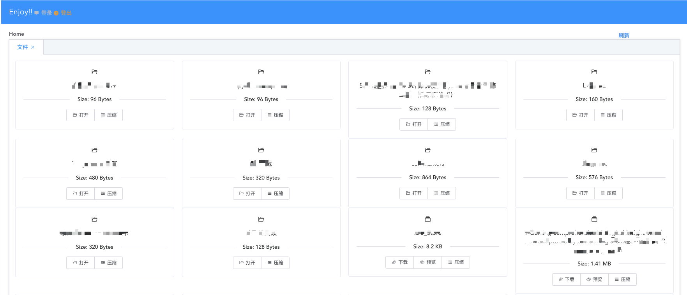

- [goptions](https://github.com/voxelbrain/goptions)：构建命令行
- [gin](https://github.com/gin-gonic/gin)：比起beego这种重型框架，还是喜欢这种轻量级的
- [gin-sessions](https://github.com/gin-contrib/sessions)：gin的session插件，用户登录操作
- [archiver](https://github.com/mholt/archiver)：压缩文件，压缩文件夹，方便下载文件夹。不过当然不是边压缩边下载，那么复杂干嘛。
- [go-rice](https://github.com/GeertJohan/go.rice)：打包静态文件，便于编译成统一的二进制

然后使用Vue + elementUI重写了页面，效果如下：


---

```bash
$ ./server/server_linux_amd64 -h
Usage: server_linux_amd64 [global options]

Global options:
            --host           host (default: 127.0.0.1)
            --port           port (default: 5000)
            --dir            File directory (default: server)
            --user           Username (default: admin)
            --passwd         Password (default: admin)
            --disable-delete Disable delete button
        -h, --help           Show this help

```
